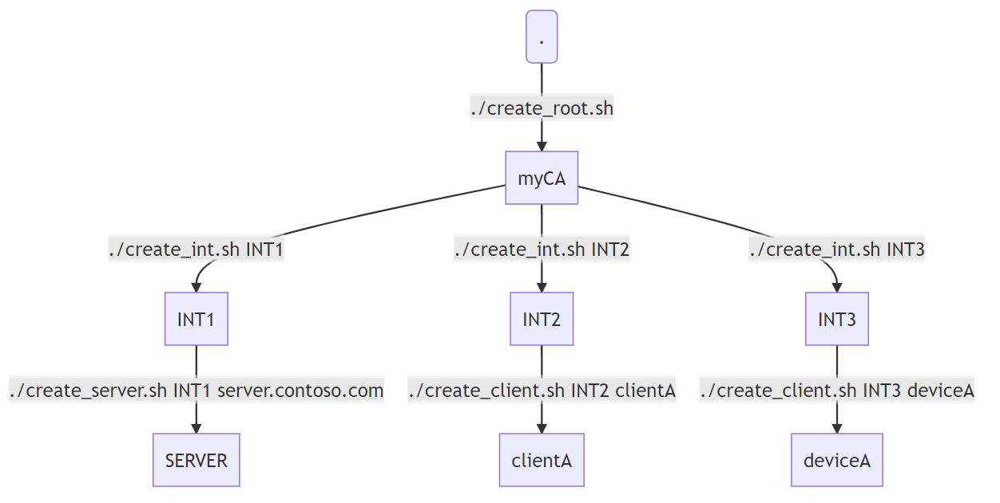

A simple CA for creating self-signed root, intermediate and leaf (client/server) x509 certificates. For testing purposes only.
You just need a bash shell and openssl.

  

## getting started
Optionally clear the CA store:
```bash
sudo rm -rf /root/ca
```

Grab the scripts:
```bash
cd
sudo rm -rf ~/my-simple-bash-ca
git clone https://github.com/arlotito/my-simple-bash-ca
cd ~/my-simple-bash-ca/scripts
chmod +x *.sh
```

Customize ./scripts/*.openssl.cnf files as needed or keep default values.

You can now create your certs. As an example, to create certs as per the diagram above:
```bash
cd ~/my-simple-bash-ca/scripts
sudo ./create_root.sh

sudo ./create_int.sh INT1
sudo ./create_server.sh INT1 server.contoso.com

sudo ./create_int.sh INT2
sudo ./create_client.sh INT2 clientA

sudo ./create_int.sh INT3  
sudo ./create_client.sh INT3 deviceA  
```

All the certificates are stored in `/root/ca`.

## view and verify certs
To optionally view the ROOT certificate:
```bash
sudo openssl x509 -noout -in /root/ca/certs/ca.cert.pem -noout -subject
sudo openssl x509 -noout -in /root/ca/certs/ca.cert.pem -noout -issuer
```

To view the INTERMEDIATE certificates:

```bash
# NOTE: replace `<INTERMEDIATE>` with the intermediate name
sudo openssl x509 -noout -in <INTERMEDIATE>/certs/intermediate.cert.pem -noout -subject
sudo openssl x509 -noout -in <INTERMEDIATE>/certs/intermediate.cert.pem -noout -issuer
```

To verify INTERMEDIATE against ROOT:
```bash
# NOTE: replace `<INTERMEDIATE>` with the intermediate name
sudo openssl verify -CAfile /root/CA/certs/ca.cert.pem /root/CA/<INTERMEDIATE>/certs/intermediate.cert.pem
```